<h1 align="center">Age Group Enrollment System</h1>

This project is a backend application designed to manage enrollments and age groups, **developed in Python using the FastAPI framework**. The application allows users to register in different age groups and manage their enrollments, utilizing a message queuing system to process requests.

## Flowchart

Below is a flowchart that illustrates the architecture and process flow of the system. This flowchart helps visualize the interactions between the different APIs, the message queue system, the enrollment processor, and the database:

```mermaid
graph TB
    subgraph api1["Age Group API"]
        RG["Register New Age Group"]
        EG["Delete Age Group"]
        VG["View Existing Age Groups"]
    end

    subgraph api2["Enrollment API"]
        SM["Enrollment Request"]
        CM["Check Enrollment Status"]
    end

    subgraph mq["Enrollment Queue"]
        RQM["RabbitMQ"]
    end

    subgraph proc["Enrollment Processor"]
        script["Python Script (stadolene script)"]
    end

    subgraph db["MongoDB"]
        AET["Age Group Data Storage"]
        ADM["Enrollment Data Storage"]
    end

    RG -->|Adds age group| AET
    EG -->|Removes age group| AET
    VG -->|Queries age groups| AET

    script -->|Validates age with age group| AET
    SM -->|Sends to queue| RQM
    CM -->|Checks status| ADM

    RQM -->|Processes requests| script
    script -->|Records result| ADM

    api1 -. "Database Access" .-> db
    api2 -. "Database Access" .-> db
    script -. "Database Access" .-> db

    classDef default fill:#444,stroke:#aaa,stroke-width:2px;
    classDef api fill:#667,stroke:#ccc,stroke-width:2px;
    classDef storage fill:#866,stroke:#ccc,stroke-width:2px;
    classDef queue fill:#768,stroke:#ccc,stroke-width:2px;
    classDef process fill:#686,stroke:#ccc,stroke-width:2px;

    class api1,api2 api;
    class db storage;
    class mq queue;
    class proc process;
```




---

## How to Use the Project

### 1. Clone the Repository
  - After cloning, navigate to the cloned project directory to begin setup.

### 2. Run the Application Using Docker
Execute the following command to start the application containers in the background. Ensure Docker is installed on your system before proceeding.

```bash
docker-compose up -d
```
 - **Environment Variables:** To facilitate testing and setup, the `.env` file has been intentionally uploaded to the repository.

### 3. Access the APIs

- Once the Docker containers are running, you can test if the APIs are operational by accessing the following health check URLs:
  - **Age Group API:** `http://localhost:8000/heath-check`
  - **Enrollment API:** `http://localhost:8001/heath-check`

- **Explore Interactive API Documentation:**
  - Swagger documentation for the Enrollment API is available at `http://localhost:8001/docs`.
  - Swagger documentation for the Age Group API is available at `http://localhost:8000/docs`.

- **Manage RabbitMQ:**
  - Access the interactive RabbitMQ management dashboard at `http://localhost:15672/`.

### 4. Running Tests

To execute tests, use the following commands. These commands run tests specifically for each service within their respective Docker containers:

- **Enrollment API Tests:**
  ```bash
  docker-compose run api-enrollment sh -c "pytest"
  ```

- **Age Group API Tests:**
  ```bash
  docker-compose run api-age-group sh -c "pytest"
  ```

### Additional Information
- **Basic Authentication:** The Age Group API is protected by Basic Authentication. To access and test this API, use the username: `admin` and password: `secret`.
- **Environment Variables:** To facilitate testing and setup, the `.env` file has been intentionally uploaded to the repository. This file contains essential configurations, eliminating the need for initial environment setup by users.
- **Database Seeding**: To simplify initial testing and usage, the database is pre-populated with the following sample data:
  - **Enrollment Records**:
    ```json
    [
        {"name": "John Doe", "cpf": "12345678901", "age": 9, "enrollment_status": "active"},
        {"name": "Jane Doe", "cpf": "12345678902", "age": 19, "enrollment_status": "active"},
        {"name": "Joe Doe", "cpf": "12345678903", "age": 29, "enrollment_status": "active"},
        {"name": "Jill Doe", "cpf": "12345678904", "age": 39, "enrollment_status": "active"}
    ]
    ```
  - **Age Group Definitions**:
    ```json
    [
        {"min_age": 1, "max_age": 10},
        {"min_age": 11, "max_age": 20},
        {"min_age": 21, "max_age": 30},
        {"min_age": 31, "max_age": 40}
    ]
    ```


## Project Functionality
Below is a detailed description of how the system operates:

- **Age Group Registration:** Authenticated users can register new age groups by specifying minimum and maximum ages via the Age Group API.
- **Age Group Deletion and Viewing:** Age groups can be deleted or viewed by authenticated users. This ensures that management of age groups is secure and controlled.
- **Enrollment Request:** Users can apply for enrollment by providing their name, Social Security Number (or equivalent), and age through the Enrollment API. This request is then sent to a message queue (RabbitMQ).
- **Enrollment Processing:** The enrollment processor retrieves the message from the queue, checks if the applicant's age fits within an existing age group, and processes the enrollment.
- **Data Storage:** Data regarding age groups and enrollments are stored in MongoDB, ensuring reliable and scalable data management.
- **Status Inquiry:** Users can check the status of their enrollments in real-time through the Enrollment API. This feature enhances user engagement and transparency in the enrollment process.

--- 

